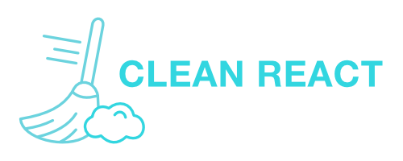

  

  <h3 align="center">
    🚧  Clean-React 🚀 Em construção...  🚧
  </h3>

## Sobre
  > Este projeto é um treinamento de programação focado nas melhores
  > Práticas de programação como: TDD, Clean-architecture, Design partner,
  > solid, CI-CD e muitas outras. Isto com intuito de tornar um dev com as
  > hardSkill necessária para alavancar a carreira.  

## Índice do Conteúdo
<!--ts-->
   * [Sobre](#Sobre)
   * [Indice de Conteudo](#Indice-de-conteudo)
   * [Features](#Features)
   * [Instalação](#instalacao)
   * [Como usar](#como-usar)
   * [Tecnologias](#tecnologias)
<!--te-->

### Features

- [x] Login
- [x] signup
